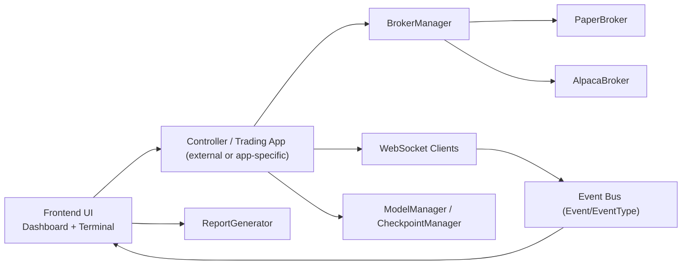

# Sopotek Trading AI - Full Application Guide

## 1) What this app is
Sopotek Trading AI is an event-driven trading application with:
- Broker integrations (live and paper trading)
- Real-time market data via websockets
- Desktop UI (PySide6 + PyQtGraph)
- Model persistence/checkpoint helpers
- Basic backtest/reporting placeholders

Current maturity: **alpha**. Core skeleton and module structure are in place; some advanced flows are currently lightweight implementations.

## 2) High-level architecture



## 3) Repository layout

```text
sopotek-trading-ai/
  pyproject.toml
  requirements.txt
  README.md
  RELEASE_CHECKLIST.md
  docs/
    FULL_APP_GUIDE.md
  src/
    sopotek_trading_ai/
      __main__.py
      broker/
      manager/
      market_data/websocket/
      event_bus/
      frontend/ui/
      backend/
      models/
      config/
```

## 4) Component reference

### 4.1 Broker layer
- `broker/base_broker.py`
  - Abstract async broker contract (`connect`, `close`, `fetch_balance`, `create_order`, `cancel_order`).
- `broker/PaperBroker.py`
  - In-memory paper execution: tracks balance, positions, orders, and unrealized PnL.
- `broker/alpaca_broker.py`
  - Alpaca integration through `alpaca_trade_api` REST client.

### 4.2 Broker orchestration
- `manager/broker_manager.py`
  - Registers brokers by asset class.
  - Routes symbols to broker (`BTC/USDT` -> crypto, `EUR_USD` -> forex, `AAPL` -> stocks).
  - Connect/close all registered brokers concurrently.

### 4.3 Market data and events
- `market_data/websocket/alpaca_web_socket.py`
- `market_data/websocket/coinbase_web_socket.py`
  - Stream ticks/quotes and publish normalized events.
- `event_bus/event.py`
  - Event dataclass.
- `event_bus/event_types.py`
  - Event type enum (`MARKET_TICK`).

### 4.4 UI
- `frontend/ui/dashboard.py`
  - Login/config dashboard with saved account handling.
- `frontend/ui/terminal.py`
  - Main trading terminal and panels (charts, trade logs, AI monitor, risk views, etc.).
- `frontend/ui/chart/ChartWidget.py`
  - Chart wrapper with fallback behavior if graph dependency is unavailable.
- `frontend/ui/system_console.py`
  - Logging widget/fallback logger.
- `frontend/ui/report_generator.py`
  - Lightweight export helpers.
- `frontend/ui/login_dialog.py`
  - Minimal credential dialog.

### 4.5 Backend helpers
- `backend/strategy/backtest_engine.py`
  - Backtest stub used by the terminal flow.
- `backend/utils/utils.py`
  - Data normalization helper (`candles_to_df`).

### 4.6 Models and persistence
- `models/model_manager.py`
  - Save/load model artifacts.
- `models/checkpoints/checkpoint_manager.py`
  - Save periodic checkpoint files.

### 4.7 Credentials
- `config/credential_manager.py`
  - Secure account profile storage via `keyring`.

## 5) Runtime flows

### 5.1 Login/connect flow
1. User enters broker config on `Dashboard`.
2. Config is emitted via `login_requested` signal.
3. Controller handles async login and broker initialization.
4. On success, terminal can be opened and streaming enabled.

### 5.2 Market data flow
1. Websocket client subscribes by symbol.
2. Incoming payload is normalized.
3. `Event(type=MARKET_TICK, data=...)` is published.
4. UI/controller consumers update charts/tables/state.

### 5.3 Order flow
1. UI triggers order action.
2. Broker selection via `BrokerManager.get_broker(symbol)`.
3. Order dispatched to selected broker (paper/live).
4. Position, balance, and logs are refreshed.

## 6) Setup and install

### 6.1 Local development
```bash
python -m venv .venv
.venv\Scripts\activate
python -m pip install -U pip
python -m pip install -r requirements.txt
```

### 6.2 Package install
```bash
python -m pip install .
```

### 6.3 Dev tools
```bash
python -m pip install -U build twine pytest
```

## 7) Testing, build, and release

### 7.1 Run tests
```bash
set PYTHONPATH=src
python -m unittest discover -s tests -p "test_*.py" -v
```

### 7.2 Build package artifacts
```bash
python -m build
```

### 7.3 Validate package metadata
```bash
python -m twine check dist/*
```

### 7.4 Publish
```bash
python -m twine upload dist/*
```

## 8) Configuration

Use `.env` for credentials and runtime secrets.

Example:
```env
ALPACA_API_KEY=your_key
ALPACA_SECRET=your_secret
```

Security guidance:
- Never commit real secrets.
- `.env` is gitignored.
- Prefer OS keyring for long-lived credential storage.

## 9) Dependency notes

For compatibility with `alpaca-trade-api` the project constrains:
- `urllib3<2`
- `websockets<11`

If your environment already has newer versions, reinstall with project constraints:
```bash
python -m pip install -U "urllib3<2" "websockets<11"
python -m pip install -r requirements.txt
```

## 10) Known limitations (alpha)

- Terminal contains many advanced UI hooks that assume a rich external controller runtime.
- Several backend components are currently placeholders intended for expansion.
- End-to-end exchange connectivity and strategy execution should be validated in a staging environment before live use.

## 11) Suggested next enhancements

- Add a concrete controller/app runner under `sopotek_trading_ai/app.py`.
- Expand tests for broker routing, websocket message normalization, and UI signal wiring.
- Introduce structured logging and runtime configuration schema.
- Add CI workflow for lint/test/build/twine-check gates.
